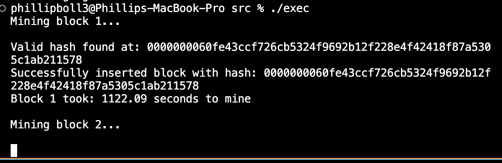
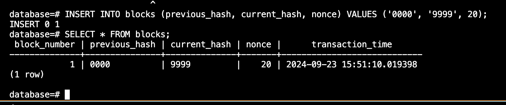

Blockchain Project 

By Phillip Boll

-------------------------------

This readme file contains information regarding many aspects of the project, 
one of the first things you must do before attempting to run it is to install the openssl library. 
This library is used for the encryption in the blockchain. I am using SHA256, the most up-to-date 512 bit encryption

Single vs Multi Threading
--------------------------
1. The goal for this program is to achieve multi threading during mining of blocks in the blockchain
2. Multi threading is essentially where we run multiple asepcts of this program on different processors side by side
3. Multi threading is necessary for blockchain especially when the difficulty of finding hashes increases past 2-3 leading zeroes 
4. At the current time (Thu Sep 19th) this program uses single threading to mine blocks, this may not be the case anymore depending on when you are reading 

Hashing (SHA256):
--------------------------

1. SHA256 is the cryptographic hashing function, the same used in cryptocurrencies like Bitcoin. 
2. Some of the characteristics are the following:
    2a. Fixed Length: Output is always a 64 char hex 
    2b. The same input produces the same output, always
    2c. Small changes in input will cause majorly different output
    2d. You cannot reverse engineer it 
    2e. Every output is unique to its input(no two inputs create same output)

3. So how is it used in this project? (rhetorical question) :
    3a. Previous Block Hash
    3b. Transaction history
    3c. Nonce 
    
    These are all used to determine a unique hash 

4. We combine the previous hash, nonce, timestamp and other data available into a string. Then the SHA256 algorithm is used to hash the string. The result is a unique identification we can use to find the block and link it in the chain. 

5. If any block is changed, the hash will also change making it immune to hacking since this will invalidate the block chain. 

6. What you're probably thinking: "WOW phillip, you explained this so well!!!" 

Transactions (timestamps):
---------------------------

1. Transactions follow ISO8601 Format which is YYYY-MM-DD followed by the time 
2. An example of the format is: 2024-09-11T15:30:00Z
3. The "T" separates the date from the time 
4. The "Z" at the end of the time is to denote what time zone it is. We are using UTC (Universal Timezone Coordinates)
5. The purpose of timestamps is to keep track of transactions which is why each block in the blockchain contains a list of transactional timestamps

WARNING: Transactions are not in a readable format unless you convert them with ctime function, for example they'll pop up like this: 
-----------------------------------------------------

Transactions: 1726520457

You can read them with this if you'd like:
ctime(&(current->transactions));

How I create my executables (This depends on your system since OpenSSL gets tricky depending on where your computer stores it):
-----------------------------------------------------

g++ -o exec main.cpp -I/opt/homebrew/opt/openssl@3/include -L/opt/homebrew/opt/openssl@3/lib -lssl -lcrypto

The most up-to-date executable for using the database:
------------------------------------------------------

g++ -std=c++17 -o exec main.cpp db.cpp \
-I/opt/homebrew/opt/openssl@3/include \
-I/opt/homebrew/opt/postgresql@14/include \
-I/opt/homebrew/include \
-L/opt/homebrew/opt/openssl@3/lib \
-L/opt/homebrew/opt/postgresql@14/lib \
-L/opt/homebrew/opt/libpqxx/lib \
-lssl -lcrypto -lpqxx 

./exec

POW (Proof of Work ):
-----------------------------------------------------

1. For this project, proof of work will usually be set to an easy-medium level since we want to simply showcase my understanding of how blockchain works 

2. For those who don't understand POW, the more leading 0's you have in your hash requirements, the harder it becomes for your program to generate a valid hash 

3. Easy Difficulty hashes usually have between 1 and 3 leading zeros. 3 leading zeros means only 1 in 4,096 hashes are going to be valid for adding a block to the blockchain

4. Medium Difficulty is between 4 and 6 leading zeros. 6 leading zeros means only 1 in over 16 million hashes will be valid. 

5. Hard Difficulty is between 7 and 9 leading zeros. 9 leading zeros means only 1 in over 68 billion (WOW) hashes will be valid for the blockchain. 

---------------------------------------------------------

The following is an image showing the mining of an 8 leading zeros hash, taking approximately 18 minutes. Anything higher would take hours to day to mine with single threading on a macbook. 

---------------------------------------------------------

-----------------------------------------------------

USING THE SQL DATABASE (POSTGRESQL):

1. I am using postgresql for my database since it is widely used in industry compared to mysql and supports a broader range of languages

2. Simply put, I created a .cpp and .h file for inserting into the database blocks after mining from our doubly linked list blockchain in c++

3. The following are some simple commands to use if you are new to postgresql:

Connecting to PostgreSQL: 

psql -d database
   // in this case database is just the name of the database i created

Executing SQL File:

\i path/to/database.sql

\i /Users/phillipboll3/Desktop/Blockchain/
src/database.sql

Verifying that the table was created and exists:

\dt

W3 Schools is a great source for learning SQL, I used that school to learn what I know about SQL for this project:

https://www.w3schools.com/sql/sql_create_table.asp

------------------------------------------------

Connecting PostgreSQL to C++ Blockchain:

1. We use another library called pqxx
2. Pqxx connects the two and allows us to call functions in C++ which insert data directly into our database 
3. The port, username, and password are required to do so. 
4. You can check the default port being used by PostgreSQL through the command:

cat $(brew --prefix)/var/postgresql@14/postgresql.conf | grep port

5. The default for me: 5432

---------------------------------------------------

Common Workflow for accessing database after running executable:

brew services start postgresql@14
psql -U phillipboll3 -d database
SELECT * FROM blocks;

